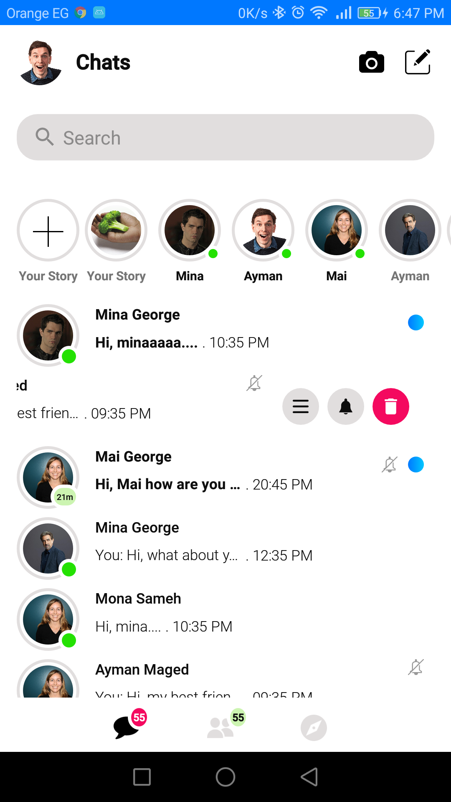
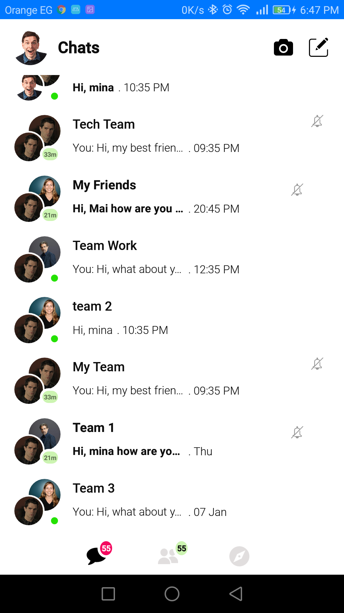

# Messenger Layout

This repository contains a copy of facebook messenger layout.


# Screenshots :

  


### Contributing.
All pull requests are welcome, make sure to follow the contribution guidelines when you submit pull request.
1. Fork it!
2. Checkout the development branch: `git checkout development`
3. Create your feature branch: `git checkout -b my-new-feature`
4. Add your changes to the index: `git add .`
5. Commit your changes: `git commit -m 'Add some feature'`
6. Push to the branch: `git push origin my-new-feature`
7. Submit a pull request against the `development` branch

### License
```
   Copyright (C) 2018 Mina George

   Licensed under the Apache License, Version 2.0 (the "License");
   you may not use this file except in compliance with the License.
   You may obtain a copy of the License at

       http://www.apache.org/licenses/LICENSE-2.0

   Unless required by applicable law or agreed to in writing, software
   distributed under the License is distributed on an "AS IS" BASIS,
   WITHOUT WARRANTIES OR CONDITIONS OF ANY KIND, either express or implied.
   See the License for the specific language governing permissions and
   limitations under the License.
```